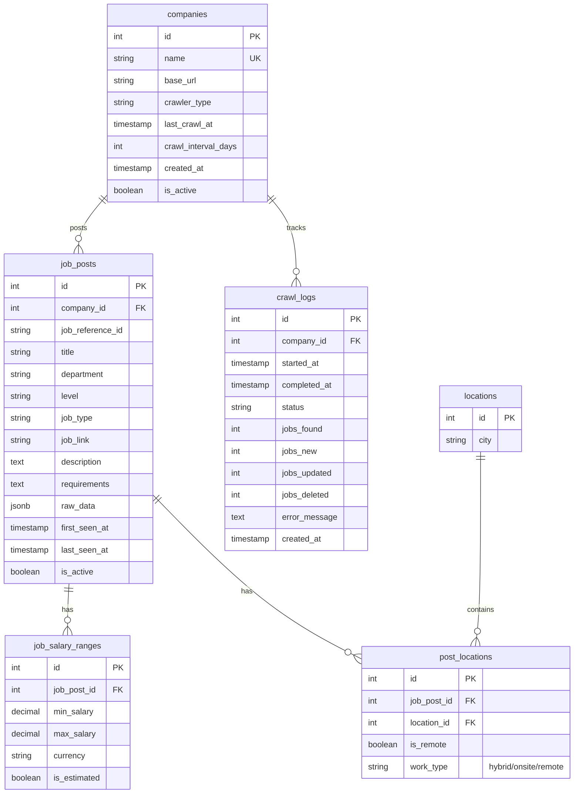

```mermaid
erDiagram
    companies ||--o{ job_posts : posts
    companies ||--o{ crawl_logs : tracks
    job_posts ||--o{ job_salary_ranges : has
    job_posts ||--o{ post_locations : has
    locations ||--o{ post_locations : contains
    
    companies {
        int id PK
        string name UK
        string base_url
        string crawler_type
        timestamp last_crawl_at
        int crawl_interval_days
        timestamp created_at
        boolean is_active
    }

    job_posts {
        int id PK
        int company_id FK
        string job_reference_id
        string title
        string department
        string level
        string job_type
        string job_link
        text description
        text requirements
        jsonb raw_data
        timestamp first_seen_at
        timestamp last_seen_at
        boolean is_active
    }

    locations {
        int id PK
        string city
    }

    post_locations {
        int id PK
        int job_post_id FK
        int location_id FK
        boolean is_remote
        string work_type "hybrid/onsite/remote"
    }

    job_salary_ranges {
        int id PK
        int job_post_id FK
        decimal min_salary
        decimal max_salary
        string currency
        boolean is_estimated
    }

    crawl_logs {
        int id PK
        int company_id FK
        timestamp started_at
        timestamp completed_at
        string status
        int jobs_found
        int jobs_new
        int jobs_updated
        int jobs_deleted
        text error_message
        timestamp created_at
    }
```